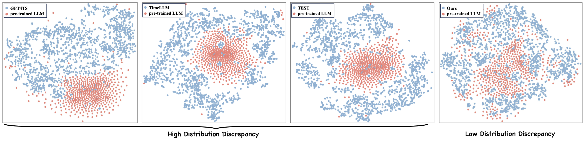
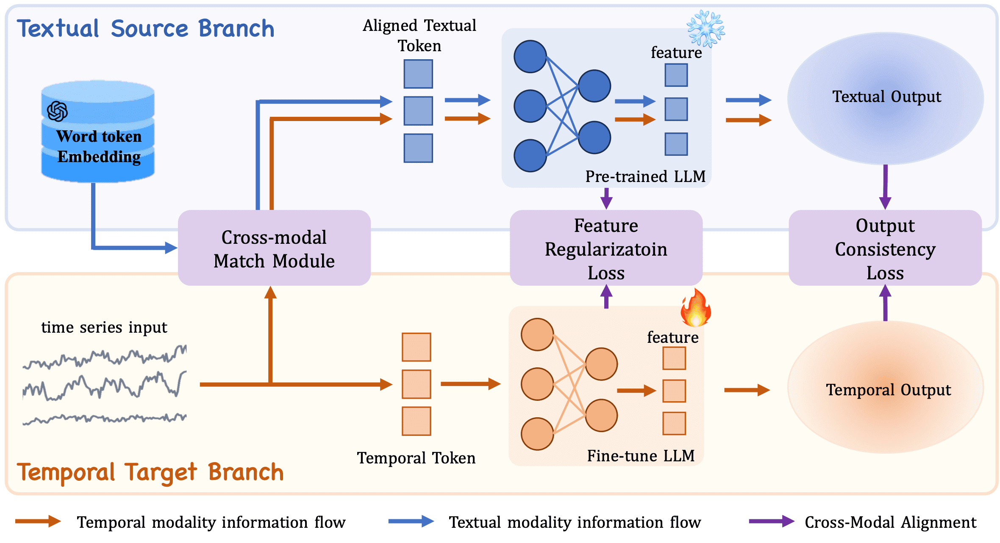

<p align="center">
     
</p>

# CALF: Aligning LLMs for Time Series Forecasting via Cross-modal Fine-Tuning

[](https://arxiv.org/abs/2403.07300)


## Introduction

CALF (Orignal name: LLaTA) is a novel  cross-modal fine-tuing framework that effectively bridges the ***distribution discrepancy*** between temporal data and the textual nature of LLMs, as shown in [Figure 1](#fig-discrepancy).

<p align="center" id="fig-discrepancy">
    
    <br>
    <strong>Figure 1:</strong> The t-SNE visualization of pre-trained word token embeddings of LLM with temporal tokens from <a href="https://github.com/DAMO-DI-ML/NeurIPS2023-One-Fits-All">GPT4TS</a> (Left) and our method (Right). Our method shows more cohesive integration, indicating effective modality alignment.
</p>

To bridge the modality gap between textual and temporal data, we introduce three meticulously designed cross-modal fine-tuning techniques (see [Figure 2](#fig-workflow)): 
- **Cross-Modal Match Module** integrates time series and textual inputs through principal word embedding extraction and a cross-attention mechanism, ensuring efficient alignment of the marginal input distribution between time series and text.
- **Feature Regularization Loss** aligns the outputs of each intermediate layer, ensuring that gradients at every layer are more effectively guided for better weight updates.
- **Output Consistency Loss** ensures that the output representations of textual and temporal series modalities correspond effectively, resolving discrepancies in the representation space and maintaining consistent semantic context for time series data. 

<p align="center" id="fig-workflow">
     
    <br>
    <strong>Figure 2:</strong> Conceptual illustration of cross-modal fine-tuning technique.
</p>

## Prerequisites
Before proceeding, ensure Python 3.9 is installed. Install the required dependencies with the following command:

```
pip install -r requirements.txt
```

## Dataset Preparation

### Long-term Forecasting
Acquire datasets from [Autoformer](https://drive.google.com/drive/folders/1ZOYpTUa82_jCcxIdTmyr0LXQfvaM9vIy). Organize them in the `./datasets` directory as shown below:

```
datasets
├── electricity
│   └── electricity.csv
├── ETT-small
│   ├── ETTh1.csv
│   ├── ETTh2.csv
│   ├── ETTm1.csv
│   └── ETTm2.csv
├── traffic
│   └── traffic.csv
└── weather
    └── weather.csv
```

### Short-term Forecasting
For short-term forecasting, download the M4 datasets from [Time-Series-Library](https://drive.google.com/drive/folders/15zio96o3NK4XOoR5L88oaWcJDVOiqQo9). Place the `m4` folder within `./datasets`.

## Preparing Word Token Embeddings

Execute the command below to extract principal components from the word token embeddings:

```
python pca.py
```

These embeddings will be saved in `./wte_pca_500.pt`.

## Model Training

Training scripts are located in the `./scripts` folder. For instance, to train the CALF model on the ETTh2 dataset for long-term forecasting, execute:

```
sh scripts/long_term_forecasting/ETTh2.sh
```

For short-term forecasting, use:

```
sh scripts/short_term_forecasting/m4.sh
```

Post-Training:

- Trained models will be saved in `./checkpoints`.
- Numerical results are available in `.npy` format under `./results`.
- Detailed summaries of performance metrics can be found in `./results_{task_name}.txt`.

## Citation
If this repository contributes to your research, please consider citing our work:

```
@article{liu2024taming,
      title={CALF: Aligning LLMs for Time Series Forecasting via Cross-modal Fine-Tuning}, 
      author={Liu, Peiyuan and Guo, Hang and Dai, Tao and Li, Naiqi and Bao, Jigang and Ren, Xudong and Jiang, Yong and Xia, Shu-Tao},
      journal={arXiv preprint arXiv:2403.07300},
      year={2024},
      arxiv={2403.07300}
}
```

## Acknowledgements

Our gratitude extends to the authors of the following repositories for their foundational model implementations:

- [Autoformer](https://github.com/thuml/Autoformer)
- [Time-Series-Library](https://github.com/thuml/Time-Series-Library)
- [PatchTST](https://github.com/yuqinie98/PatchTST)
- [Crossformer](https://github.com/Thinklab-SJTU/Crossformer)
- [One-Fits-All](https://github.com/DAMO-DI-ML/NeurIPS2023-One-Fits-All)

## Contact Us
For inquiries or further assistance, contact us at [lpy23@mails.tsinghua.edu.cn](mailto:lpy23@mails.tsinghua.edu.cn) or open an issue on this repository.
